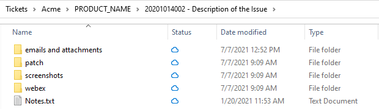

# Support Ticket Folder: Folder Creating Automation

The purpose of this cli tool is to streamline the process of setting folders for organizing information related to a support ticket. The application can be configured to create sets of folders organized by company name, product name, and ticket number.



This tool can also be used in other scenarios where organization, retrieval, easy access is desired. 

### Installation

Run the installer **VSMTicketFolder_Install.msi**

### Add entry to the Enviroment

Run **SystemPropertiesAdvanced**, Go to enviroment variables

Add a new entry for the Path system variable with the following

    C:\Program Files (x86)\Support\VSMTicketFolder\

### Configure application

Go to 

    C:\Program Files (x86)\Support\VSMTicketFolder
    
Edit **vsmTicketFolder.exe.config**

```xml
<?xml version="1.0" encoding="utf-8" ?>
<configuration>
  <configSections>
    <section name="CommonFolders" type="System.Configuration.NameValueSectionHandler"/>
    <section name="ProductAlphaFolders" type="System.Configuration.NameValueSectionHandler"/>
    <section name="ProductBetaFolders" type="System.Configuration.NameValueSectionHandler"/>
  </configSections>
  <appSettings>
        <add key="dirPath" value="C:\Users\[USER_NAME]\Tickets" />
        <add key="defaultProduct" value="ProductAlpha" />
  </appSettings>
  <CommonFolders>
    <add key="0" value="emails and attachments" />
    <add key="1" value="screenshots" />
    <add key="2" value="webex" />
  </CommonFolders>
  <ProductAlphaFolders>
    <add key="0" value="patch" />
  </ProductAlphaFolders>
  <ProductBetaFolders>
    <add key="0" value="cases" />
  </ProductBetaFolders>
  <startup>
    <supportedRuntime version="v4.0" sku=".NETFramework,Version=v4.7.2" />
  </startup>
</configuration>
```

### Test

Open a command line window and type the following

```BASH
vsmTicketFolder -c CompanyName -p ProductName -t 20220731002 -d "Testing"
``` 
It should create and open a ticket folder test.

### Help

To get a list of parameters, execute the following command. 

```BASH
vsmTicketFolder -?
```
